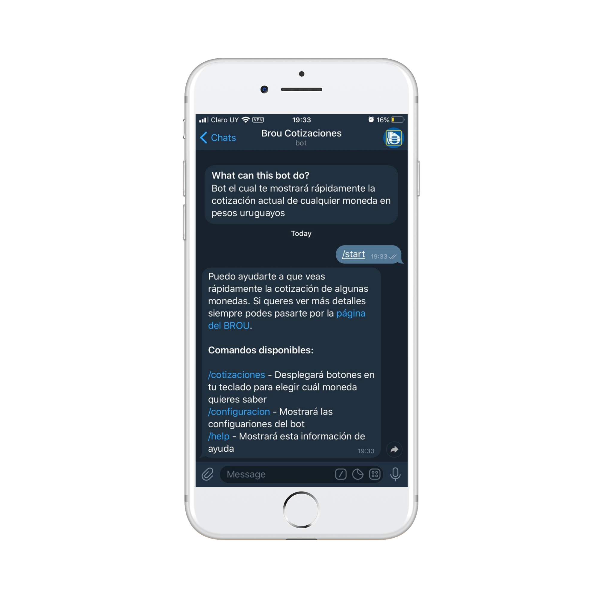

<p align="center">
  
</p>

<p align="center">Telegram bot that will show you the value of foreigns currencies in uruguayan pesos</p>

> **Warning**: CotizacionesUyBot is in active development and is **not involved with BROU**. You can visit [the oficial page of BROU](https://www.brou.com.uy/cotizaciones) to see the oficial information. All data is extracted from their oficial site.



## Setup

### Pre-Installation

Before working locally, you must create a Bot in [BotFather](https://telegram.me/BotFather) in order to get an API Token.

You can follow the instructions to get this token in [the official documentation of Telegram](https://core.telegram.org/bots#creating-a-new-bot).

After that, you have to create a mongoose database.

Then create a `.env` file in the root of the project, and add the token client ID and mongo uri..

```bash
BOT_KEY=xxx
MONGO_URI=xxxx
```

### Installation

```bash
git clone git@github.com:Publicker/CotizacionesUyBot.git
cd CotizacionesUyBot
npm i
```

#### Development mode

In the development environment, an Express server is running on port `3000` to handle all API calls, and the BOT will be wake up and ready for answer all your questions. To run both of these servers concurrently, run the `watch` and `dev` command in different instances of consoles.

```bash
npm run watch
npm run dev
```

#### Production mode

In the production environment, the application is built, then excecute the main at `dist` directory.

```bash
npm run build && npm run start
```

## Contributing

TakeNote is an open source project, and contributions of any kind are welcome and appreciated. Open issues, bugs, and feature requests are all listed on the [issues](https://github.com/taniarascia/takenote/issues) tab and labeled accordingly. Feel free to open bug tickets and make feature requests. Easy bugs and features will be tagged with the `good first issue` label.

View [CONTRIBUTING.md](CONTRIBUTING.md) to learn about the style guide, folder structure, scripts, and how to contribute.

## Contributors

Thanks goes to these wonderful people:

<!-- ALL-CONTRIBUTORS-LIST:START - Do not remove or modify this section -->
<!-- prettier-ignore-start -->
<!-- markdownlint-disable -->
<table>
  <tr>
    <td align="center"><a href="https://www.taniarascia.com"><br /><sub><b>Tania Rascia</b></sub></a><br /><a href="https://github.com/taniarascia/takenote/commits?author=taniarascia" title="Code">💻</a> <a href="#ideas-taniarascia" title="Ideas, Planning, & Feedback">🤔</a> <a href="https://github.com/taniarascia/takenote/issues?q=author%3Ataniarascia" title="Bug reports">🐛</a></td>
    <td align="center"><a href="https://github.com/hankolsen"><br /><sub><b>hankolsen</b></sub></a><br /><a href="https://github.com/taniarascia/takenote/commits?author=hankolsen" title="Code">💻</a> <a href="https://github.com/taniarascia/takenote/issues?q=author%3Ahankolsen" title="Bug reports">🐛</a> <a href="https://github.com/taniarascia/takenote/commits?author=hankolsen" title="Tests">⚠️</a></td>
    <td align="center"><a href="https://github.com/joseph-perez"><br /><sub><b>Joseph Perez</b></sub></a><br /><a href="https://github.com/taniarascia/takenote/commits?author=joseph-perez" title="Code">💻</a></td>
    <td align="center"><a href="https://cutting.scot"><br /><sub><b>Paul</b></sub></a><br /><a href="https://github.com/taniarascia/takenote/commits?author=dagda1" title="Code">💻</a> <a href="https://github.com/taniarascia/takenote/commits?author=dagda1" title="Tests">⚠️</a></td>
    <td align="center"><a href="https://martinbrosenberg.com/"><br /><sub><b>Martin Rosenberg</b></sub></a><br /><a href="https://github.com/taniarascia/takenote/commits?author=MartinRosenberg" title="Code">💻</a> <a href="https://github.com/taniarascia/takenote/issues?q=author%3AMartinRosenberg" title="Bug reports">🐛</a> <a href="#maintenance-MartinRosenberg" title="Maintenance">🚧</a></td>
    <td align="center"><a href="http://codepen.io/meowwwls"><br /><sub><b>Melissa</b></sub></a><br /><a href="https://github.com/taniarascia/takenote/commits?author=meowwwls" title="Code">💻</a></td>
    <td align="center"><a href="https://github.com/jjtowle"><br /><sub><b>Jason Towle</b></sub></a><br /><a href="https://github.com/taniarascia/takenote/commits?author=jjtowle" title="Code">💻</a></td>
  </tr>
  <tr>
    <td align="center"><a href="http://blog.isquaredsoftware.com"><br /><sub><b>Mark Erikson</b></sub></a><br /><a href="#ideas-markerikson" title="Ideas, Planning, & Feedback">🤔</a></td>
    <td align="center"><a href="http://www.alphonsebouy.fr"><br /><sub><b>Alphonse Bouy</b></sub></a><br /><a href="https://github.com/taniarascia/takenote/issues?q=author%3Aalphonseb" title="Bug reports">🐛</a></td>
    <td align="center"><a href="https://github.com/dave2kb"><br /><sub><b>dave2kb</b></sub></a><br /><a href="#design-dave2kb" title="Design">🎨</a> <a href="#ideas-dave2kb" title="Ideas, Planning, & Feedback">🤔</a></td>
    <td align="center"><a href="https://github.com/Dantaro"><br /><sub><b>Devin McIntyre</b></sub></a><br /><a href="https://github.com/taniarascia/takenote/commits?author=Dantaro" title="Code">💻</a></td>
    <td align="center"><a href="http://slofish.io"><br /><sub><b>Jeffrey Fisher</b></sub></a><br /><a href="https://github.com/taniarascia/takenote/issues?q=author%3Ajeffslofish" title="Bug reports">🐛</a></td>
    <td align="center"><a href="https://github.com/dong-alex"><br /><sub><b>Alex Dong</b></sub></a><br /><a href="https://github.com/taniarascia/takenote/commits?author=dong-alex" title="Code">💻</a></td>
    <td align="center"><a href="https://github.com/Publicker"><br /><sub><b>Publicker</b></sub></a><br /><a href="https://github.com/taniarascia/takenote/commits?author=Publicker" title="Code">💻</a></td>
  </tr>
  <tr>
    <td align="center"><a href="https://github.com/kleyu"><br /><sub><b>Jakub Naskręski</b></sub></a><br /><a href="https://github.com/taniarascia/takenote/commits?author=kleyu" title="Code">💻</a> <a href="https://github.com/taniarascia/takenote/issues?q=author%3Akleyu" title="Bug reports">🐛</a> <a href="https://github.com/taniarascia/takenote/commits?author=kleyu" title="Tests">⚠️</a></td>
    <td align="center"><a href="https://opw0011.github.io/"><br /><sub><b>Benny O</b></sub></a><br /><a href="https://github.com/taniarascia/takenote/commits?author=opw0011" title="Code">💻</a></td>
    <td align="center"><a href="https://github.com/justDOindev"><br /><sub><b>Justin Payne</b></sub></a><br /><a href="https://github.com/taniarascia/takenote/commits?author=justDOindev" title="Code">💻</a></td>
    <td align="center"><a href="https://yikjin.github.io"><br /><sub><b>marshmallow</b></sub></a><br /><a href="#maintenance-yikjin" title="Maintenance">🚧</a></td>
    <td align="center"><a href="http://jfelix.info"><br /><sub><b>Jose Felix </b></sub></a><br /><a href="https://github.com/taniarascia/takenote/commits?author=Jfelix61" title="Code">💻</a></td>
    <td align="center"><a href="https://xboston.dev"><br /><sub><b>Nikolay Kirsh</b></sub></a><br /><a href="https://github.com/taniarascia/takenote/commits?author=xboston" title="Code">💻</a></td>
    <td align="center"><a href="https://github.com/Mudassar045"><br /><sub><b>Mudassar Ali</b></sub></a><br /><a href="https://github.com/taniarascia/takenote/commits?author=Mudassar045" title="Code">💻</a></td>
  </tr>
  <tr>
    <td align="center"><a href="https://nathanbland.github.io/"><br /><sub><b>Nathan Bland</b></sub></a><br /><a href="https://github.com/taniarascia/takenote/issues?q=author%3ANathanBland" title="Bug reports">🐛</a> <a href="https://github.com/taniarascia/takenote/commits?author=NathanBland" title="Code">💻</a></td>
    <td align="center"><a href="http://craiglam.com"><br /><sub><b>Craig Lam</b></sub></a><br /><a href="https://github.com/taniarascia/takenote/commits?author=siliconeidolon" title="Code">💻</a> <a href="https://github.com/taniarascia/takenote/issues?q=author%3Asiliconeidolon" title="Bug reports">🐛</a> <a href="https://github.com/taniarascia/takenote/commits?author=siliconeidolon" title="Tests">⚠️</a></td>
    <td align="center"><a href="https://twitter.com/ashinzekene"><br /><sub><b>Ashinze Ekene</b></sub></a><br /><a href="https://github.com/taniarascia/takenote/issues?q=author%3Aashinzekene" title="Bug reports">🐛</a> <a href="https://github.com/taniarascia/takenote/commits?author=ashinzekene" title="Code">💻</a></td>
    <td align="center"><a href="https://adityasriram.ga"><br /><sub><b>Harry Sullivan</b></sub></a><br /><a href="https://github.com/taniarascia/takenote/commits?author=harrySullivan" title="Code">💻</a></td>
    <td align="center"><a href="https://github.com/moudev"><br /><sub><b>Mauricio Martínez</b></sub></a><br /><a href="https://github.com/taniarascia/takenote/commits?author=moudev" title="Code">💻</a></td>
    <td align="center"><a href="http://www.bugs.cc/"><br /><sub><b>Black-Hole</b></sub></a><br /><a href="https://github.com/taniarascia/takenote/commits?author=BlackHole1" title="Code">💻</a></td>
    <td align="center"><a href="https://zogan.de/"><br /><sub><b>Frank Blendinger</b></sub></a><br /><a href="https://github.com/taniarascia/takenote/commits?author=yogan" title="Code">💻</a></td>
  </tr>
  <tr>
    <td align="center"><a href="https://www.osiux.ws"><br /><sub><b>Eduardo Reveles</b></sub></a><br /><a href="https://github.com/taniarascia/takenote/commits?author=osiux" title="Code">💻</a></td>
    <td align="center"><a href="https://github.com/leofrozenyogurt"><br /><sub><b>Leo Royzengurt</b></sub></a><br /><a href="https://github.com/taniarascia/takenote/commits?author=leofrozenyogurt" title="Code">💻</a> <a href="https://github.com/taniarascia/takenote/issues?q=author%3Aleofrozenyogurt" title="Bug reports">🐛</a></td>
    <td align="center"><a href="https://github.com/kcvgan"><br /><sub><b>kcvgan</b></sub></a><br /><a href="https://github.com/taniarascia/takenote/commits?author=kcvgan" title="Code">💻</a> <a href="https://github.com/taniarascia/takenote/issues?q=author%3Akcvgan" title="Bug reports">🐛</a></td>
    <td align="center"><a href="https://github.com/codytowstik"><br /><sub><b>Cody Towstik</b></sub></a><br /><a href="https://github.com/taniarascia/takenote/commits?author=codytowstik" title="Code">💻</a> <a href="https://github.com/taniarascia/takenote/commits?author=codytowstik" title="Tests">⚠️</a> <a href="https://github.com/taniarascia/takenote/issues?q=author%3Acodytowstik" title="Bug reports">🐛</a></td>
    <td align="center"><a href="https://github.com/vincentdoerig"><br /><sub><b>Vincent Dörig</b></sub></a><br /><a href="https://github.com/taniarascia/takenote/commits?author=vincentdoerig" title="Tests">⚠️</a> <a href="https://github.com/taniarascia/takenote/commits?author=vincentdoerig" title="Code">💻</a></td>
    <td align="center"><a href="https://github.com/miqh"><br /><sub><b>Michael Huynh</b></sub></a><br /><a href="https://github.com/taniarascia/takenote/commits?author=miqh" title="Code">💻</a> <a href="https://github.com/taniarascia/takenote/issues?q=author%3Amiqh" title="Bug reports">🐛</a></td>
    <td align="center"><a href="https://github.com/code128"><br /><sub><b>Joshua Bloom</b></sub></a><br /><a href="https://github.com/taniarascia/takenote/commits?author=code128" title="Code">💻</a></td>
  </tr>
  <tr>
    <td align="center"><a href="https://github.com/Mxchaeltrxn"><br /><sub><b>Mxchaeltrxn</b></sub></a><br /><a href="https://github.com/taniarascia/takenote/commits?author=Mxchaeltrxn" title="Code">💻</a> <a href="https://github.com/taniarascia/takenote/commits?author=Mxchaeltrxn" title="Tests">⚠️</a></td>
    <td align="center"><a href="https://konradstaniszewski.com"><br /><sub><b>Konrad Staniszewski</b></sub></a><br /><a href="https://github.com/taniarascia/takenote/commits?author=KonradStanski" title="Documentation">📖</a></td>
    <td align="center"><a href="https://github.com/yohix"><br /><sub><b>Yohix</b></sub></a><br /><a href="#maintenance-yohix" title="Maintenance">🚧</a></td>
    <td align="center"><a href="https://github.com/jackson-elfers"><br /><sub><b>Jackson Elfers</b></sub></a><br /><a href="https://github.com/taniarascia/takenote/commits?author=jackson-elfers" title="Code">💻</a></td>
    <td align="center"><a href="https://github.com/vamshi-tg"><br /><sub><b>Vamshi</b></sub></a><br /><a href="https://github.com/taniarascia/takenote/commits?author=vamshi-tg" title="Code">💻</a></td>
    <td align="center"><a href="https://github.com/pavlakissimos"><br /><sub><b>Simos</b></sub></a><br /><a href="https://github.com/taniarascia/takenote/commits?author=pavlakissimos" title="Code">💻</a> <a href="https://github.com/taniarascia/takenote/commits?author=pavlakissimos" title="Tests">⚠️</a></td>
  </tr>
</table>

<!-- markdownlint-enable -->
<!-- prettier-ignore-end -->
<!-- ALL-CONTRIBUTORS-LIST:END -->

## Acknowledgements

- A big thank you to [David Bock](https://dkbock.com/) for logo design.

## Author

- [Tania Rascia](https://www.taniarascia.com)

## License

This project is open source and available under the [MIT License](LICENSE).